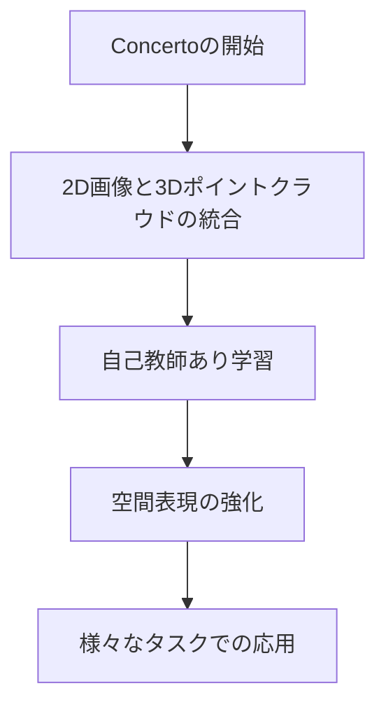
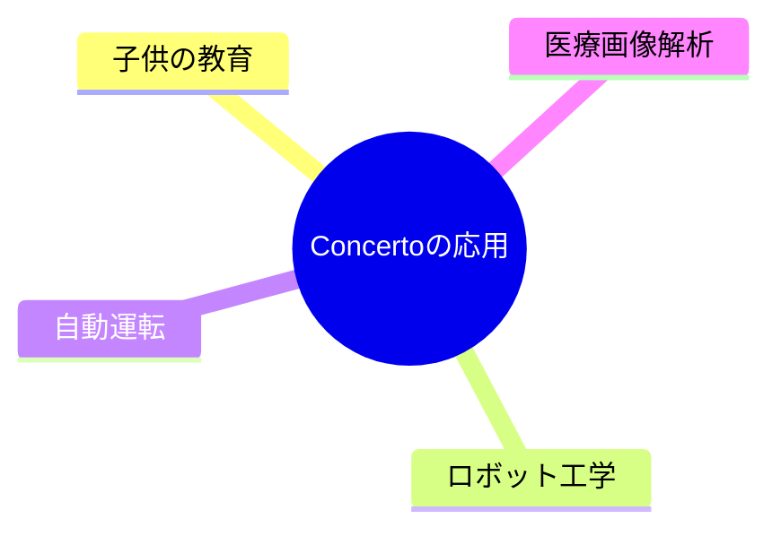

# 2Dと3Dで学ぶ空間理解

---

## 目次

- Concertoってなに？
- 2Dと3Dを一緒に使う
- 自分で学ぶ力
- いろんな情報をまとめる
- 少ないデータでも大丈夫

---

## 技術フロー図

**この図はConcertoがどのように2Dと3Dのデータを統合して学び、応用されるかを示しています。**

---

## Concertoってなに？

👩‍🏫 先生: 「Concertoって知ってる？これは2Dと3Dのデータを使って、コンピュータが空間をもっとよく理解できるようにする方法なんだよ。」

👦 生徒: 「へぇ、2Dと3Dを一緒に使うんだね！」

---

## 2Dと3Dを一緒に使う

👩‍🏫 先生: 「2Dの画像と3Dの形を一緒に使うと、コンピュータはもっと詳しく物の形や位置を理解できるんだ。」

👦 生徒: 「だから、もっと正確に物を見分けられるんだね！」

---

## 自分で学ぶ力

👩‍🏫 先生: 「Concertoは自分で学ぶ力を持っているの。人が教えなくても、データを見てどんどん賢くなるんだよ。」

👦 生徒: 「すごい！自分で勉強するロボットみたいだね。」

---

## いろんな情報をまとめる

👩‍🏫 先生: 「Concertoは、いろんな情報をまとめて考えることができるの。だから、もっと豊かな理解ができるんだ。」

👦 生徒: 「いろんなことを一緒に考えると、もっと賢くなれるんだね！」

---

## 少ないデータでも大丈夫

👩‍🏫 先生: 「Concertoは、少ないデータでもしっかり学べるの。だから、たくさんのデータがなくても大丈夫なんだよ。」

👦 生徒: 「少ないデータでも賢くなれるなんて、すごいね！」

---

## 活用例図

**この図はConcertoがどのような分野で応用されるかを示しています。**

---

## まとめ

- Concertoは、2D画像と3Dポイントクラウドを組み合わせて、より優れた空間的な理解を実現します。
- 自己教師あり学習を使うことで、注釈なしで強力な空間表現を学び、様々なタスクで高性能を発揮します。
- 複数の感覚情報を統合することで、より豊かで予測可能な表現を形成します。
- Concertoは、少ないデータでも効率的に学習し、他の方法よりも優れた結果を出します。
- 2Dと3Dのデータを組み合わせることで、空間をより深く理解し、表現力を向上させます。