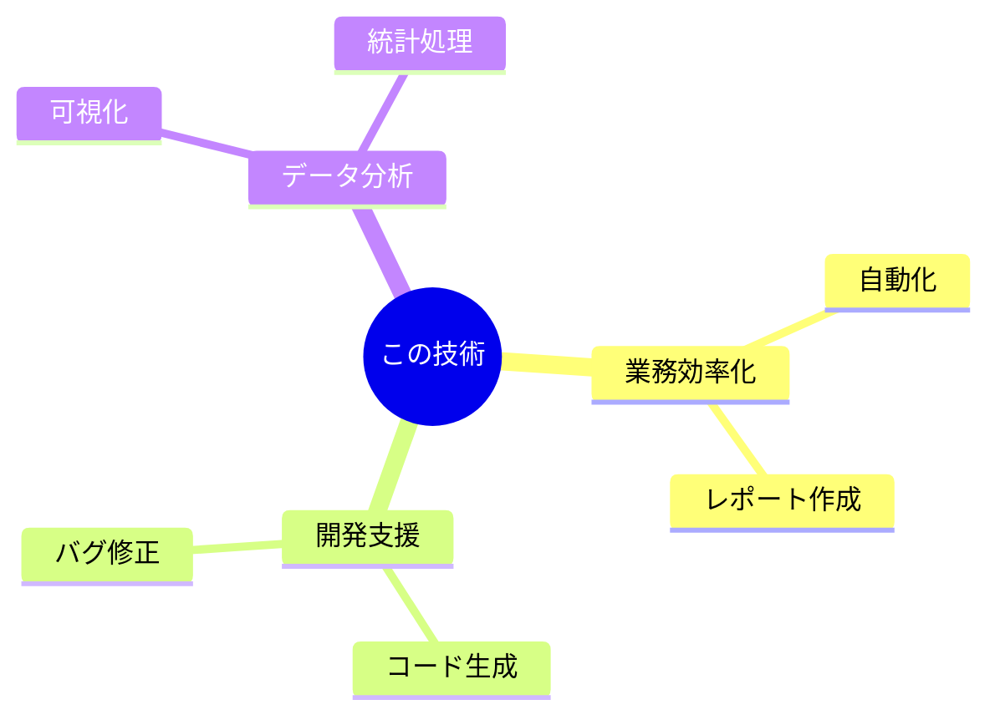

# 多言語AIで文書解析

---

## Agenda

- PaddleOCR-VLって何？
- たくさんの言語に対応
- 少ない力で大きな力
- 複雑な文書もおまかせ
- いろんなものを正確に認識
- 速くてたくさん処理できる
- GPUメモリを節約しよう

---

## 📊 技術の仕組み

**この図は、技術の全体フローを示しています**

---

## PaddleOCR-VLって何？

👩‍🏫 先生: 「PaddleOCR-VLって知ってる？これはAIを使って文書を読み取るすごい技術なんだよ！」

👦 生徒: 「AIが文書を読むの？どうやって？」

👩‍🏫 先生: 「そう！AIが文書の中の文字や図を理解してくれるんだ。」

---

## たくさんの言語に対応

🌍 先生: 「このAIはなんと109の言語を理解できるんだ！」

👧 生徒: 「えっ、そんなにたくさん？！」

👩‍🏫 先生: 「そう、だから世界中の文書を読むことができるんだよ。」

---

## 少ない力で大きな力

💪 先生: 「このAIは少ない力で大きな力を発揮するんだ。」

👦 生徒: 「どういうこと？」

👩‍🏫 先生: 「つまり、あまりコンピュータの力を使わなくても、すごく賢く動けるってことさ。」

---

## 複雑な文書もおまかせ

📚 先生: 「複雑な文書もおまかせ！このAIは難しいレイアウトもちゃんと理解できるんだ。」

👧 生徒: 「それって、どういう文書？」

👩‍🏫 先生: 「例えば、たくさんの表や図がある文書だね。」

---

## いろんなものを正確に認識

🔍 先生: 「このAIはテキストだけじゃなくて、表や数式、チャートも認識できるんだ。」

👦 生徒: 「すごい！全部見分けられるんだね。」

👩‍🏫 先生: 「そう、だからいろんな種類の情報を取り出せるんだよ。」

---

## 速くてたくさん処理できる

⚡ 先生: 「このAIはとっても速くて、たくさんの文書を一度に処理できるんだ。」

👧 生徒: 「それって便利だね！」

👩‍🏫 先生: 「うん、だから大きな会社でも使われているんだよ。」

---

## GPUメモリを節約しよう

💾 先生: 「このAIはGPUのメモリを節約することもできるんだ。」

👦 生徒: 「それってどういうこと？」

👩‍🏫 先生: 「つまり、コンピュータのメモリをあまり使わずに、効率よく動けるってことだよ。」

---

## 🎯 活用例

---

## まとめ

- PaddleOCR-VLは、109の言語に対応し、複雑な文書要素を効率的に認識できるモデルです。
- このモデルは、少ないリソースで高い性能を発揮し、実際の場面での利用に適しています。
- PaddleOCR-VLは、特に複雑なレイアウトの文書を分析するために設計されており、高速な処理速度を持っています。
- モデルは、テキスト、表、数式、チャートなどを正確に認識し、特に多言語対応に優れています。
- PaddleOCR-VLは、GPUメモリの使用量を削減しながら、迅速な推論を実現し、大量のドキュメント処理に適しています。
