# Issue #25 実装計画: Mermaid図解統合

**作成日**: 2025-10-28
**Issue**: https://github.com/miyata09x0084/slide-pilot/issues/25
**ブランチ**: `feature/25-mermaid-integration`

---

## 🎯 実装方針

### 基本原則
各ステップで**必ず動作確認**してから次に進む。1ステップ=10-20分以内。

### アーキテクチャ
**変更なし**: バックエンドでSlidev PDF生成を継続
**追加**: フロントエンドでMermaid図解をレンダリング

```
LLM → Markdown生成（Mermaid含む） → Slidev PDF生成
           ↓                              ↓
    Supabaseに保存               PDFダウンロード可能
           ↓
    ブラウザでプレビュー（Mermaid表示対応）
```

---

## 📋 Phase 1: フロントエンドMermaid表示（35分）

### なぜ最初にやるか
- ✅ バックエンドに依存しない（独立してテスト可能）
- ✅ 手動でMermaid付きMarkdownを作成して即座に確認できる
- ✅ 失敗してもバックエンドに影響なし

---

### Step 1.1: mermaidパッケージインストール（5分）

**作業内容**:
```bash
cd frontend
npm install mermaid
```

**成功基準**:
- ✅ `package.json`に`mermaid`が追加される
- ✅ `npm install`がエラーなく完了

**確認方法**:
```bash
grep mermaid frontend/package.json
```

**コミット**: `feat(frontend): mermaidパッケージ追加`

---

### Step 1.2: SlideViewer.tsxにMermaid初期化追加（5分）

**ファイル**: `frontend/src/components/SlideViewer.tsx`

**変更箇所1**: import追加（行8付近）
```typescript
import mermaid from 'mermaid';
```

**変更箇所2**: Mermaid初期化（行10付近、コンポーネント外）
```typescript
// Mermaid初期化
mermaid.initialize({
  startOnLoad: false,
  theme: 'default',
  securityLevel: 'loose',
});
```

**成功基準**:
- ✅ TypeScriptのコンパイルエラーなし
- ✅ フロントエンドが起動する（`npm run dev`）

**確認方法**:
```bash
cd frontend
npm run dev
# ブラウザで http://localhost:5173 が開けるか確認
```

**コミット**: `feat(frontend): mermaid初期化設定追加`

---

### Step 1.3: Mermaidコンポーネント実装（10分）

**ファイル**: `frontend/src/components/SlideViewer.tsx`

**変更箇所**: Mermaidコンポーネント追加（行24付近）
```typescript
import { useEffect, useRef } from 'react';

// Mermaidダイアグラムコンポーネント
function MermaidDiagram({ chart, index }: { chart: string; index: number }) {
  const ref = useRef<HTMLDivElement>(null);

  useEffect(() => {
    if (ref.current && chart) {
      const id = `mermaid-diagram-${index}`;
      mermaid.render(id, chart)
        .then(({ svg }) => {
          if (ref.current) {
            ref.current.innerHTML = svg;
          }
        })
        .catch((err) => {
          console.error('Mermaid render error:', err);
          if (ref.current) {
            ref.current.innerHTML = '<pre style="color: red;">図解のレンダリングに失敗しました</pre>';
          }
        });
    }
  }, [chart, index]);

  return <div ref={ref} style={{ margin: '24px auto', textAlign: 'center' }} />;
}
```

**成功基準**:
- ✅ TypeScriptのコンパイルエラーなし
- ✅ フロントエンドが起動する

**確認方法**: コンパイルのみ（まだ使用していない）

**コミット**: `feat(frontend): MermaidDiagramコンポーネント追加`

---

### Step 1.4: ReactMarkdownのcodeコンポーネント修正（15分）

**ファイル**: `frontend/src/components/SlideViewer.tsx`

**変更箇所**: ReactMarkdownのcomponents（行105付近）

**変更前**:
```typescript
code: (props) => {
  const { children, ...rest } = props;
  const inline = !String(children).includes('\n');
  return inline ? (
    <code style={styles.inlineCode} {...rest}>{children}</code>
  ) : (
    <pre style={styles.codeBlock}>
      <code {...rest}>{children}</code>
    </pre>
  );
},
```

**変更後**:
```typescript
code: (props) => {
  const { children, className, ...rest } = props;
  const match = /language-(\w+)/.exec(className || '');
  const language = match ? match[1] : '';
  const inline = !String(children).includes('\n');

  // Mermaid図解の場合
  if (language === 'mermaid' && !inline) {
    return <MermaidDiagram chart={String(children).replace(/\n$/, '')} index={0} />;
  }

  // 通常のコードブロック
  return inline ? (
    <code style={styles.inlineCode} {...rest}>{children}</code>
  ) : (
    <pre style={styles.codeBlock}>
      <code {...rest}>{children}</code>
    </pre>
  );
},
```

**成功基準**:
- ✅ TypeScriptのコンパイルエラーなし
- ✅ 既存のスライド表示が壊れていない

**確認方法**:
```bash
# 1. フロントエンド起動
cd frontend && npm run dev

# 2. ブラウザで既存スライド（Mermaidなし）を開いて正常表示を確認
```

**コミット**: `feat(frontend): Mermaidコードブロックのレンダリング対応`

---

### Step 1.5: 手動テスト用Markdownでテスト（10分）

**テスト用Markdown**:
```markdown
---
title: Mermaidテスト
theme: apple-basic
---

# Mermaidテスト

---

## Agenda

- テスト1
- テスト2

---

## フローチャートテスト

```mermaid
flowchart LR
    A[開始] --> B[処理]
    B --> C[終了]
```



これはテストです

---

## まとめ

テスト完了
```

**確認方法**:
1. 上記Markdownを `backend/data/slides/test-mermaid_slidev.md` に保存
2. Supabaseに手動で挿入（または既存スライドのMarkdownを書き換え）
3. フロントエンドでプレビュー
4. flowchartが図として表示されるか確認

**成功基準**:
- ✅ Mermaid図解が**図として**表示される（コードブロックではない）
- ✅ 既存のスライド表示も正常

**コミット**: なし（テストのみ）

---

## 📋 Phase 2: バックエンド図解生成ノード（65分）

**前提条件**: Phase 1が成功していること

---

### Step 2.1: State拡張（5分）

**ファイル**: `backend/app/agents/slide_workflow.py`（行117付近）

**追加内容**:
```python
class State(TypedDict, total=False):
    # ... 既存フィールド ...

    # ══════════════════════════════════════════════════════════
    # 図解生成 (Node D.5) - 新規追加
    # ══════════════════════════════════════════════════════════
    diagrams: Dict[str, Any]  # 生成された図解のメタデータ
```

**成功基準**:
- ✅ Pythonの構文エラーなし
- ✅ 既存ワークフローが動作する

**確認方法**:
```bash
cd backend
python3 -m py_compile app/agents/slide_workflow.py
```

**コミット**: `feat(backend): State に diagrams フィールド追加`

---

### Step 2.2: ヘルパー関数実装（20分）

**ファイル**: `backend/app/agents/slide_workflow.py`（行480付近に追加）

**追加内容**:
```python
# -------------------
# Mermaid図解生成ヘルパー関数
# -------------------
def _generate_architecture_flowchart(key_points: List[str]) -> str:
    """重要ポイントからアーキテクチャ図を生成"""
    return '''---

## 📊 技術の仕組み

\`\`\`mermaid
flowchart LR
    A[データ入力] --> B[前処理]
    B --> C[モデル学習]
    C --> D[評価]
    D --> E[実用化]
    style C fill:#f9f,stroke:#333,stroke-width:4px
\`\`\`

**この図は、技術の全体フローを示しています**

---'''


def _generate_use_case_mindmap(key_points: List[str]) -> str:
    """重要ポイントからユースケース図を生成"""
    return '''---

## 🎯 活用例

\`\`\`mermaid
mindmap
  root((この技術))
    開発支援
      コード生成
      バグ修正
    データ分析
      可視化
      統計処理
    業務効率化
      自動化
      レポート作成
\`\`\`

**3つの領域で実用可能です**

---'''


def _insert_after_section(slide_md: str, section_title: str, content: str) -> str:
    """指定セクション直後にコンテンツを挿入"""
    import re

    # "## section_title" の後の "---" を見つけて、その直後に挿入
    pattern = rf'(##\s+{re.escape(section_title)}.*?\n---\s*\n)'

    if re.search(pattern, slide_md, re.DOTALL):
        return re.sub(pattern, rf'\1{content}\n', slide_md, count=1, flags=re.DOTALL)
    else:
        # セクションが見つからない場合はAgenda直後に挿入（フォールバック）
        agenda_pattern = r'(##\s+(?:目次|Agenda).*?\n---\s*\n)'
        if re.search(agenda_pattern, slide_md, re.DOTALL):
            return re.sub(agenda_pattern, rf'\1{content}\n', slide_md, count=1, flags=re.DOTALL)
        return slide_md


def _insert_before_section(slide_md: str, section_title: str, content: str) -> str:
    """指定セクション直前にコンテンツを挿入"""
    import re

    # "---\n\n## section_title" の直前に挿入
    pattern = rf'(---\s*\n\n##\s+{re.escape(section_title)})'

    if re.search(pattern, slide_md):
        return re.sub(pattern, rf'{content}\n\1', slide_md, count=1)
    else:
        # セクションが見つからない場合は末尾に追加
        return slide_md + f'\n{content}'
```

**成功基準**:
- ✅ Pythonの構文エラーなし
- ✅ 関数の単体テストが通る

**確認方法**:
```python
# Pythonインタラクティブシェルでテスト
cd backend
python3
>>> from app.agents.slide_workflow import _generate_architecture_flowchart
>>> result = _generate_architecture_flowchart([])
>>> "mermaid" in result
True
>>> "flowchart" in result
True
```

**コミット**: `feat(backend): Mermaid図解生成ヘルパー関数追加`

---

### Step 2.3: generate_diagrams ノード実装（20分）

**ファイル**: `backend/app/agents/slide_workflow.py`（行480付近）

**追加内容**:
```python
# -------------------
# Node D.5: Mermaid図解生成
# -------------------
@traceable(run_name="d5_generate_diagrams")
def generate_diagrams(state: State) -> Dict:
    """Mermaid図解を生成してスライドに挿入"""
    slide_md = state.get("slide_md") or ""
    topic = state.get("topic") or ""
    key_points = state.get("key_points") or []

    # PDF以外はスキップ
    input_type = detect_input_type(topic)
    if input_type != "pdf":
        return {"diagrams": {}, "log": _log(state, "[diagrams] skipped (not PDF)")}

    diagrams_meta = {}

    try:
        # 1. アーキテクチャ図生成
        arch_diagram = _generate_architecture_flowchart(key_points)
        slide_md = _insert_after_section(slide_md, "Agenda", arch_diagram)
        diagrams_meta["architecture"] = {"type": "flowchart", "inserted": True}

        # 2. ユースケース図生成
        use_case_diagram = _generate_use_case_mindmap(key_points)
        slide_md = _insert_before_section(slide_md, "まとめ", use_case_diagram)
        diagrams_meta["use_cases"] = {"type": "mindmap", "inserted": True}

        return {
            "slide_md": slide_md,
            "diagrams": diagrams_meta,
            "log": _log(state, f"[diagrams] generated {len(diagrams_meta)} diagrams")
        }
    except Exception as e:
        return {
            "error": f"diagram_generation_error: {e}",
            "log": _log(state, f"[diagrams] EXCEPTION {e}")
        }
```

**成功基準**:
- ✅ Pythonの構文エラーなし
- ✅ ノード単体で実行できる

**確認方法**:
```python
# ノード単体テスト
cd backend
python3
>>> from app.agents.slide_workflow import generate_diagrams
>>> test_state = {
...     "slide_md": "---\n\n## Agenda\n\n- test\n\n---\n\n## まとめ\n\ntest\n\n---",
...     "topic": "test.pdf",
...     "key_points": ["test1", "test2"]
... }
>>> result = generate_diagrams(test_state)
>>> "mermaid" in result["slide_md"]
True
>>> len(result["diagrams"])
2
```

**コミット**: `feat(backend): generate_diagrams ノード実装`

---

### Step 2.4: グラフ構造修正（10分）

**ファイル**: `backend/app/agents/slide_workflow.py`（行655付近）

**変更前**:
```python
graph_builder.add_edge("write_slides_slidev", "evaluate_slides_slidev")
```

**変更後**:
```python
# ノード追加
graph_builder.add_node("generate_diagrams", generate_diagrams)

# エッジ修正
graph_builder.add_edge("generate_toc", "write_slides_slidev")
graph_builder.add_edge("write_slides_slidev", "generate_diagrams")       # 新規
graph_builder.add_edge("generate_diagrams", "evaluate_slides_slidev")    # 修正
```

**成功基準**:
- ✅ グラフがコンパイルされる
- ✅ 既存PDFで実行してエラーなし

**確認方法**:
```bash
# LangGraph devサーバー起動
cd backend
python3.11 -m langgraph_cli dev --port 2024

# 別ターミナルでヘルスチェック
curl http://localhost:2024/ok
```

**コミット**: `feat(backend): generate_diagrams をワークフローに統合`

---

### Step 2.5: 統合テスト（10分）

**テスト手順**:
```bash
# 1. バックエンドサーバー起動
cd backend/app && python3 main.py

# 2. LangGraphサーバー起動（別ターミナル）
cd backend && python3.11 -m langgraph_cli dev --port 2024

# 3. フロントエンド起動（別ターミナル）
cd frontend && npm run dev

# 4. ブラウザで http://localhost:5173
# 5. PDFアップロード（例: Scaling Agents via Continual Pre-training.pdf）
# 6. プレビュー画面で図解が表示されるか確認
```

**成功基準**:
- ✅ PDFアップロード成功
- ✅ スライド生成成功
- ✅ プレビューで2つの図解（flowchart + mindmap）が表示される
- ✅ Slidev PDFにも図解が含まれる

**確認ポイント**:
1. ブラウザプレビューでflowchartが図として表示される
2. ブラウザプレビューでmindmapが図として表示される
3. ダウンロードしたPDFにも図解が含まれる
4. 既存のAI最新情報スライド生成が壊れていない

**コミット**: なし（テストのみ）

---

## 📋 Phase 3: 評価基準更新（10分）

**前提条件**: Phase 2が成功していること

---

### Step 3.1: 評価プロンプト修正（10分）

**ファイル**: `backend/app/prompts/evaluation_prompts.py`（行17付近）

**変更内容**:
```python
EVAL_PDF_GUIDE = """評価観点と重み:
- structure(0.20): スライドの流れ、章立て、1スライド1メッセージ
- comprehensiveness(0.25): PDF全体の重要トピックをカバー + **Mermaid図解による情報量強化**
- clarity(0.25): 中学生にもわかる説明 + **図解による視覚的理解**
- readability(0.15): 簡潔明瞭、視認性
- engagement(0.15): 興味を引く工夫 + **図解による理解促進**
合格: score >= 8.0

【重要】
- PDFの最初のページだけでなく、全体の流れを反映していること
- 専門用語は中学生にもわかる言葉で説明されていること
- 絵文字や視覚要素で視覚的に理解しやすいこと

【Mermaid図解評価（加点要素）】
以下の図解が含まれてい���場合、該当する観点に加点:

1. **アーキテクチャ図 (flowchart)** - 推奨
   - Agenda直後に配置され、技術フローが明確: comprehensiveness +0.5点
   - なし: 減点なし

2. **ユースケース図 (mindmap)** - 推奨
   - まとめ直前に配置され、活用例が明確: engagement +0.5点
   - なし: 減点なし

3. **図解の品質基準**
   - ✅ Mermaid構文が正しい
   - ✅ 図解の直後に説明文がある
   - ❌ 構文エラーがある場合は加点なし"""
```

**成功基準**:
- ✅ 図解がある場合、評価スコアが上がる
- ✅ 図解がなくても減点されない
- ✅ 評価ループが正常動作する

**確認方法**: 統合テストで評価スコアを確認

**コミット**: `feat(prompts): Mermaid図解の評価基準を追加`

---

## ✅ 各Phaseの成功基準まとめ

### Phase 1: フロントエンド（35分）
- ✅ mermaidパッケージがインストールされている
- ✅ 手動テスト用Markdownで図解が表示される
- ✅ 既存スライドが壊れていない

### Phase 2: バックエンド（65分）
- ✅ 新ノード`generate_diagrams`が動作する
- ✅ PDFアップロード → Markdownに2つのMermaidブロックが含まれる
- ✅ ワークフローがエラーなく完了する
- ✅ プレビューで図解が表示される
- ✅ PDFにも図解が含まれる

### Phase 3: 評価基準（10分）
- ✅ 図解があると評価スコアが上がる
- ✅ 評価ループが正常動作する

---

## 🚨 各ステップでの中断判断

各ステップで以下の場合は**即座に中断**:
- ❌ コンパイルエラー
- ❌ 既存機能が壊れる
- ❌ テストが失敗する

中断時は前のコミットに戻して原因調査。

---

## 📊 合計所要時間

- Phase 1: 35分
- Phase 2: 65分
- Phase 3: 10分

**合計**: 約110分（2時間弱）

各Phaseは独立しているため、Phase 1だけ実装して動作確認することも可能です。

---

## 📝 最終確認チェックリスト

### 実装完了時の確認事項
- [ ] Phase 1: フロントエンドでMermaid図解が表示される
- [ ] Phase 2: バックエンドで図解が自動生成される
- [ ] Phase 3: 評価基準に図解評価が含まれる
- [ ] 統合テスト: PDFアップロード → プレビュー → PDF出力の全フローが動作
- [ ] 既存機能: AI最新情報スライド生成が壊れていない
- [ ] ドキュメント: CLAUDE.mdの更新（必要に応じて）

### コミット履歴の確認
```bash
git log --oneline feature/25-mermaid-integration
```

期待されるコミット:
1. feat(frontend): mermaidパッケージ追加
2. feat(frontend): mermaid初期化設定追加
3. feat(frontend): MermaidDiagramコンポーネント追加
4. feat(frontend): Mermaidコードブロックのレンダリング対応
5. feat(backend): State に diagrams フィールド追加
6. feat(backend): Mermaid図解生成ヘルパー関数追加
7. feat(backend): generate_diagrams ノード実装
8. feat(backend): generate_diagrams をワークフローに統合
9. feat(prompts): Mermaid図解の評価基準を追加

---

## 🔗 関連リソース

- **Issue**: https://github.com/miyata09x0084/slide-pilot/issues/25
- **Mermaid公式ドキュメント**: https://mermaid.js.org/
- **Slidev Mermaid統合**: https://sli.dev/features/mermaid
- **react-markdown**: https://github.com/remarkjs/react-markdown

---

**最終更新**: 2025-10-28
